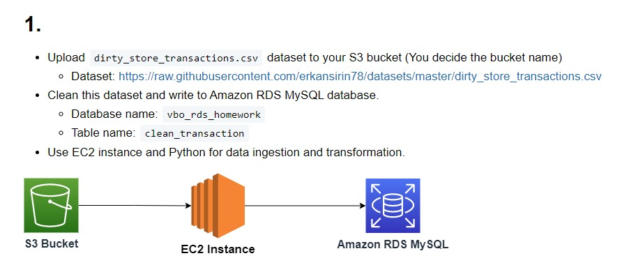
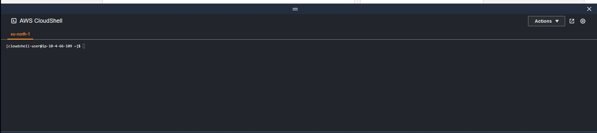

# Task


## Upload dataset to bucket
- Open cloudshell


---


Enter Commands:

```commandline
wget https://raw.githubusercontent.com/erkansirin78/datasets/master/dirty_store_transactions.csv

aws s3 cp dirty_store_transactions.csv s3://vbo-aws-dataops/week4_hw/dirty_store_transactions.csv
```
## Create EC2 Instance
- Create Instance
- SG: RdsS3Ec2
- Add role for accessing to s3
- SSH connection to Instance
```commandline
curl -O https://bootstrap.pypa.io/get-pip.py
python3 get-pip.py --user
pip3 install pandas jupyterlab boto3 pymysql sqlmodel

sudo dnf update -y
sudo dnf install mariadb105


 mysql -h s3-ec2-rds.coaziiiunvkf.eu-central-1.rds.amazonaws.com -u admin -p
```
## Create RDS MySQL
- Search RDS
- Create database
- Easy create
- Configuration: MySQL
- DB instance size: Free tier
- DB instance identifier: s3-ec2-rds
- Master password: password
- Select ec2 instance
- Additional configuration -> initial database name: rds-practice

## SSH Jupyter Instance 
- Connect to rds mysql
```commandline
mysql -h <rds_endpoint> -u admin -p
```
- Create database
```commandline
create database s3_ec2_rds;
```

## Open Jupyter and do the transformation
- run Jupyter:
```commandline
jupyter lab --ip <public ip or dns> --port 8888
```
- Open the given url for jupyter notebook, (E.g. http://ec2-18-184-35-192.eu-central-1.compute.amazonaws.com:8888/lab?token=4fc0bb78a6634c7bc96b78e2d6ab1b563797c9439b1009f5)
- Create notebook
- You can s3_ec2_rds_nb.ipynb for the python code of cleaning

## Jupyter
- Check the results
```commandline
MySQL [vbo_rds_homework]> select * from clean_transaction limit 5;
+----------+----------------+------------------+------------+------+-------+----------+-------+------------+
| STORE_ID | STORE_LOCATION | PRODUCT_CATEGORY | PRODUCT_ID | MRP  | CP    | DISCOUNT | SP    | Date       |
+----------+----------------+------------------+------------+------+-------+----------+-------+------------+
| YR7220   | New York       | Electronics      |   12254943 |   31 | 20.77 |     1.86 | 29.14 | 2019-11-26 |
| YR7220   | New York       | Furniture        |   72619323 |   15 |  9.75 |      1.5 |  13.5 | 2019-11-26 |
| YR7220   | New York       | Electronics      |   34161682 |   88 | 62.48 |      4.4 |  83.6 | 2019-11-26 |
| YR7220   | New York       | Kitchen          |   79411621 |   91 | 58.24 |     3.64 | 87.36 | 2019-11-26 |
| YR7220   | New York       | Fashion          |   39520263 |   85 |    51 |     2.55 | 82.45 | 2019-11-26 |
+----------+----------------+------------------+------------+------+-------+----------+-------+------------+
5 rows in set (0.001 sec)

MySQL [vbo_rds_homework]> describe clean_transaction;
+------------------+-------------+------+-----+---------+-------+
| Field            | Type        | Null | Key | Default | Extra |
+------------------+-------------+------+-----+---------+-------+
| STORE_ID         | varchar(64) | YES  |     | NULL    |       |
| STORE_LOCATION   | varchar(64) | YES  |     | NULL    |       |
| PRODUCT_CATEGORY | varchar(64) | YES  |     | NULL    |       |
| PRODUCT_ID       | int         | YES  |     | NULL    |       |
| MRP              | float       | YES  |     | NULL    |       |
| CP               | float       | YES  |     | NULL    |       |
| DISCOUNT         | float       | YES  |     | NULL    |       |
| SP               | float       | YES  |     | NULL    |       |
| Date             | date        | YES  |     | NULL    |       |
+------------------+-------------+------+-----+---------+-------+
9 rows in set (0.004 sec)

```
