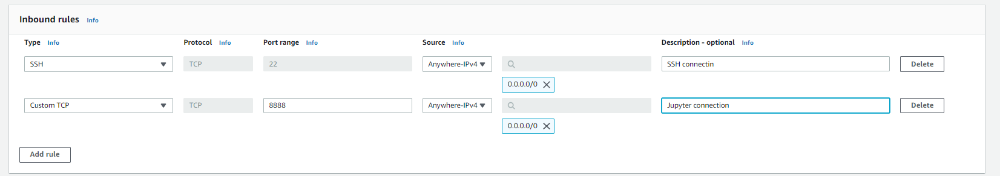

# Task: With Jupyter lab we will read csv file form S3 bucket, do some transformations with pandas then write dataset to S3 bucket.

## Dowmload Dirty Transaction Data Set to Local
- Open terminal or cmd
- Enter:
```commandline
wget https://raw.githubusercontent.com/erkansirin78/datasets/master/dirty_store_transactions.csv
```

## Upload the Data Set to S3
- Connect to AWS by using AWS CLI (If you dont know how you can check [here](https://github.com/talha002/AWS_Basics)
- Enter (change 'my-bucket' with bucketname you wish, change 'eu-central-1' with the region you wish):
```commandline
wget https://raw.githubusercontent.com/erkansirin78/datasets/master/dirty_store_transactions.csv

aws s3api create-bucket \
    --bucket my-bucket \ 0
    --create-bucket-configuration LocationConstraint=eu-central-1

aws s3 cp dirty_store_transactions.csv s3://vbo-aws-dataops/my-bucket/dirty_store_transactions.csv
```

## Create Security Group - Inbound for SSH (22) and Jupyter (8888)
- EC2 service 
- Create security group
- Security group name: `SSHJupyterSG`
- Inbound rules

---



--- 

## Create Role
- It is for EC2 to reach S3.
- IAM Service -> Roles -> Create role
- Trusted entity type: AWS service
- Use case: EC2
- Click Next
- Permission policies: `AmazonS3FullAccess`
- Name: `ec2-s3-full-role`
- Click create

## Create EC2 instance
- Open EC2 service
- Instances -> Create instance
- Name: Jupyter
- AMI: Amazon Linux 2023 AMI  Architecture: 64 bit (x86)
- Instance type: t2.micro
- Select key-pair or create new one
- Select existing security group: `SSHJupyterSG`
- Advanced details -> IAM instance profile: `ec2-s3-full-role`
- Click Launch instance

## Install Jupyter
- EC2 Instances -> Select instance -> Click connect
- SSH Client tab -> Copy example connection
- Open cmd/git bash/mac/linux terminal
- Navigate to your pem key
- SSH connection: An example connection: `ssh -i "vbo-de-demo-keypair.pem" ec2-user@ec2-18-184-35-192.eu-central-1.compute.amazonaws.com`
- Install pip and packages
```commandline
curl -O https://bootstrap.pypa.io/get-pip.py
python3 get-pip.py --user
pip3 install pandas jupyterlab boto3
```
- Run jupyter lab
```commandline
jupyter lab --ip <public ip or dns> --port 8888
```
- For example
```commandline
jupyter lab --ip ec2-18-184-135-193.eu-central-1.compute.amazonaws.com --port 8888
```

- Open browser and paste url. For example  http://ec2-18-184-35-192.eu-central-1.compute.amazonaws.com:8888/lab?token=4fc0bb78a6634c7bc96b78e2d6ab1b563797c9439b1009f5

- Create notebook
- Read data from source S3 bucket clean it then write target S3 bucket. You can check out "ec2_jupyterlab_clean_transaction_s3_pandas.ipynb" as sample notebook.
- Download your notebook to your local machine (File -> Download)
- Terminate EC2 instance
